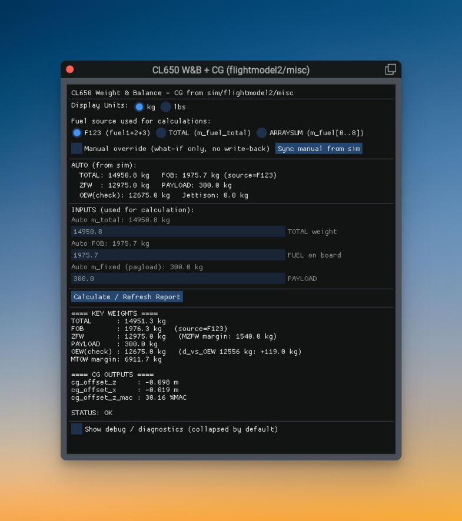

# CL650 Weight & Balance

A lightweight FlyWithLua + ImGui window for **weight & balance** and **CG readouts** in X-Plane, mainly for the hotstart CL650.  

It reads `sim/flightmodel/weight` and `sim/flightmodel2/misc` datarefs and displays key limits/margins for quick cross-checks. 

This tool is read-only and does not write back to aircraft systems or X-Plane weight/fuel datarefs. Manual inputs are what-if only for calculation. 

---

## Features

- Display units: kg / lbs
- Key computed weights: TOTAL, FOB, ZFW, etc.
- Limit & margin checks
- Custom X-Plane key/button bindings:
  - Show window `FlyWithLua/CL650WB/show_window`
  - Toggle window `FlyWithLua/CL650WB/toggle_window`

---

## Requirements

- X-Plane 12 tested
- FlyWithLua: [xplane.org](https://forums.x-plane.org/files/file/82888-flywithlua-ng-next-generation-plus-edition-for-x-plane-12-win-lin-mac/)

---

## Installation

1. Copy the script into:

   `X-Plane 12/Resources/plugins/FlyWithLua/Scripts/`

2. Launch X-Plane (or reload FlyWithLua scripts).

---

## Usage

### Open the window
You can use either:

- FlyWithLua Macro:
  - `CL650 Weight & Balance: Toggle Window`

- Key/Button bindings (X-Plane Settings → Keyboard/Joystick):
  - `FlyWithLua | CL650WB | CL650 W&B: Show window`
  - `FlyWithLua | CL650WB | CL650 W&B: Toggle window`

### Fuel source selector
The script computes FOB in different ways, which may be useful if some aircraft populate fuel datarefs differently. `F123` works well for CL650.

- **F123 (fuel1+2+3)**: uses `sim/flightmodel/weight/m_fuel1/2/3`
- **TOTAL (m_fuel_total)**: uses `sim/flightmodel/weight/m_fuel_total`
- **ARRAYSUM**: sums `sim/flightmodel/weight/m_fuel[0..8]`

### Manual override (what-if)
Enable **Manual override** to type your own TOTAL / FOB / PAYLOAD and compute what-if results.  
This does not change X-Plane’s actual weight or fuel.
